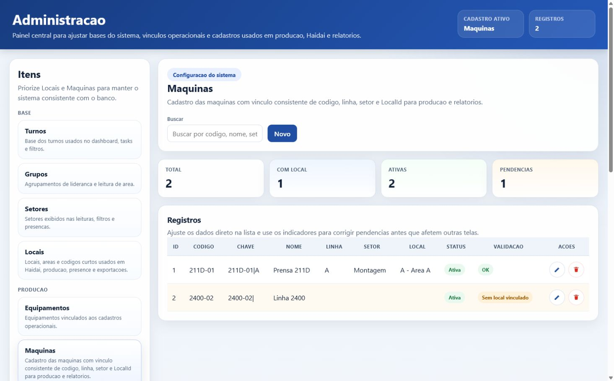
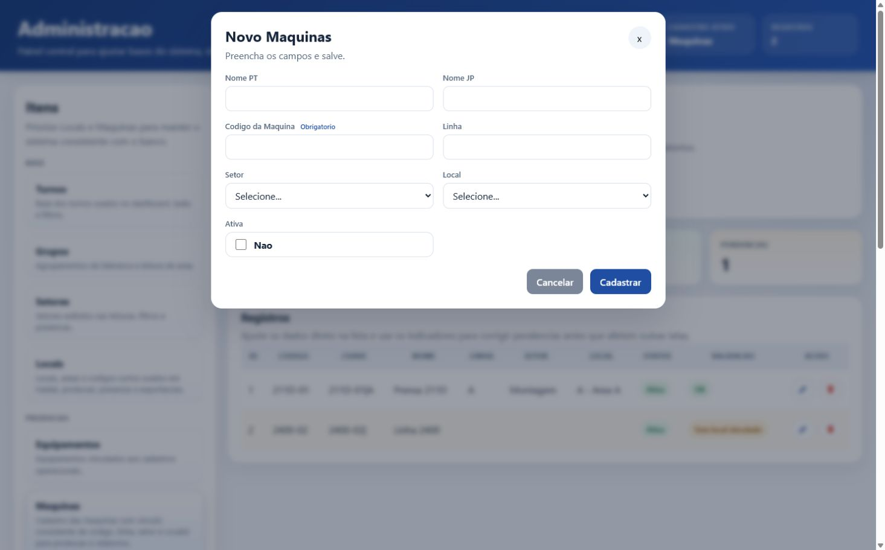
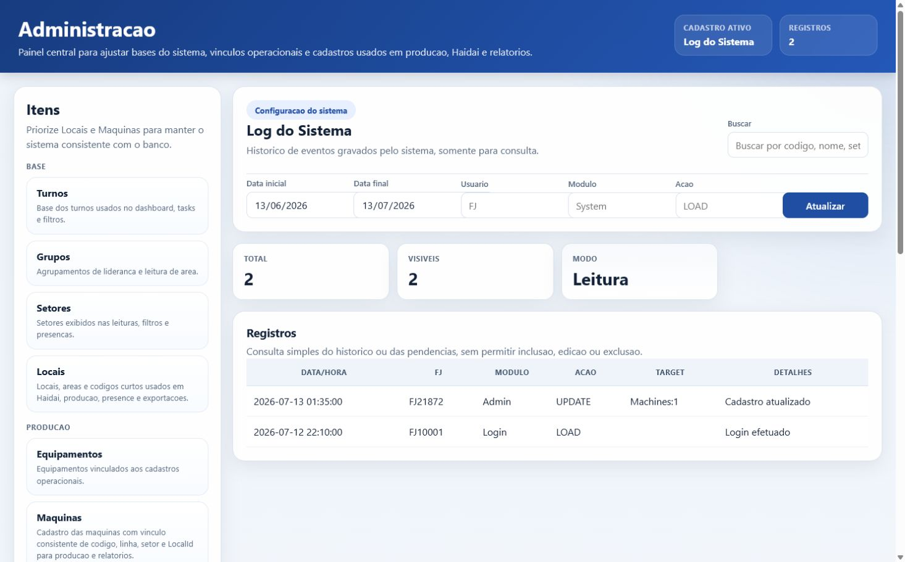

# Painel Admin

## Visao geral

O painel **Administracao** centraliza cadastros e consultas tecnicas usados por producao, Haidai, presence, follow-up, relatorios e manutencao do proprio sistema. O acesso e restrito ao perfil administrativo pelo dashboard.

Arquivos principais:

- `TeamOps.UI/Forms/HTMLFormAdmin.cs`: host WinForms/WebView2, definicao dos cadastros, consultas, validacoes e comandos de banco.
- `TeamOps.UI/ui/admin/index.html`: estrutura visual do painel.
- `TeamOps.UI/ui/admin/app.js`: renderizacao, busca, modal, filtros e mensagens para o WinForms.
- `TeamOps.UI/ui/admin/style.css`: layout e estilos.

## Prints

Os prints abaixo foram capturados com a tela HTML real do modulo e dados simulados, sem gravar no banco operacional.

## Estrutura da tela

O cabecalho mostra o nome do modulo, uma descricao curta, o cadastro ativo e a quantidade de registros carregados. A lateral esquerda lista os cadastros por grupos: Base, Producao, Follow, Pessoas e Outros. A area central mostra o cadastro selecionado, busca, acoes, indicadores e tabela.

Os indicadores mudam conforme o cadastro. Em geral mostram total, registros visiveis e modo editavel/leitura. Em **Maquinas**, mostram total, maquinas com local, maquinas ativas e pendencias. Em **Locais**, mostram total, locais com codigo, locais com maquinas e setores. Em **Pendencias de Maquina**, mostram total e tipos de inconsistencias encontradas.

## Botao a botao

| Botao ou controle | Onde aparece | Funcionalidade |
| --- | --- | --- |
| Cartoes da barra lateral | Lateral esquerda | Trocam o cadastro ativo. Ao clicar, a tela limpa os registros atuais, carrega o novo cadastro pelo WinForms e atualiza titulo, descricao, metricas, colunas e botoes. |
| Buscar | Barra superior do cadastro | Filtra localmente as linhas carregadas. A busca considera as colunas exibidas do cadastro ativo, como codigo, nome, setor, local e validacao. |
| Novo | Cadastros editaveis | Abre o modal de criacao do cadastro ativo. Fica oculto e desabilitado em telas somente leitura, como **Pendencias de Maquina** e **Log do Sistema**. |
| Editar | Coluna **Acoes** da tabela | Abre o modal preenchido com os dados da linha selecionada. Ao salvar, envia a acao `update` para o WinForms. |
| Excluir | Coluna **Acoes** da tabela | Exibe confirmacao e, se confirmada, envia a acao `delete` para o WinForms. Nao aparece em cadastros somente leitura. |
| X | Canto superior direito do modal | Fecha o modal sem salvar e limpa o estado de edicao. |
| Cancelar | Rodape do modal | Fecha o modal sem salvar e volta o estado para criacao. |
| Cadastrar | Rodape do modal em modo novo | Coleta os campos do modal e envia a acao `save` para o WinForms. |
| Salvar alteracoes | Rodape do modal em modo edicao | Coleta os campos do modal e envia a acao `update` com o `id` do registro em edicao. |
| Fundo escuro do modal | Atras do modal aberto | Fecha o modal sem salvar. |
| Data inicial | Log do Sistema | Define o inicio do periodo consultado no log. O padrao e hoje menos 30 dias. |
| Data final | Log do Sistema | Define o fim do periodo consultado no log. Se a data final for menor que a inicial, o backend inverte o periodo antes da consulta. |
| Usuario | Log do Sistema | Filtra `SystemLog.UserFJ` por trecho de FJ. |
| Modulo | Log do Sistema | Filtra `SystemLog.Module` por trecho do modulo. |
| Acao | Log do Sistema | Filtra `SystemLog.Action` por trecho da acao. |
| Atualizar | Log do Sistema | Recarrega o log usando os filtros de data, usuario, modulo e acao. |

## Cadastros disponiveis

| Grupo | Cadastro | Modo | Finalidade | Campos principais |
| --- | --- | --- | --- | --- |
| Base | Turnos | Editavel | Base dos turnos usados no dashboard, tasks e filtros. | Nome PT, Nome JP. |
| Base | Grupos | Editavel | Agrupamentos de lideranca e leitura de area. | Nome PT, Nome JP. |
| Base | Setores | Editavel | Setores exibidos nas leituras, filtros e presencas. | Nome PT, Nome JP. |
| Base | Locais | Editavel | Locais, areas e codigos curtos usados em Haidai, producao, presence e exportacoes. | Nome PT, Nome JP, Codigo Curto, Setor. |
| Producao | Equipamentos | Editavel | Equipamentos vinculados aos cadastros operacionais. | Nome PT, Nome JP. |
| Producao | Maquinas | Editavel | Cadastro das maquinas com codigo, linha, setor, LocalId e status ativo. | Nome PT, Nome JP, Codigo da Maquina, Linha, Setor, Local, Ativa. |
| Producao | Pendencias de Maquina | Somente leitura | Lista maquinas sem local, sem setor, com local inexistente ou com setor divergente. | Consulta. |
| Producao | Status de Maquina | Editavel | Status brutos importados dos arquivos de producao. Setor vazio funciona como fallback global. | Setor, Codigo, Visual, Regra eficiencia, Nome PT, Nome JP, Cor, Cor do Texto. |
| Producao | Codigos da Producao | Editavel | Legenda visual dos codigos destacados na tela de producao. | Codigo, Cor, Cor do Texto, Descricao, Ativo. |
| Producao | Tempos de Procedimento | Editavel | Tempos padrao usados na previsao de capacidade do G-Bareru. | Setor, Area opcional, Procedimento, Tempo padrao, Ativo. |
| Producao | Categorias | Editavel | Categorias usadas no Hikitsugui e em outros registros. | Nome PT, Nome JP. |
| Follow | Motivos Follow | Editavel | Motivos padrao para os acompanhamentos. | Nome PT, Nome JP. |
| Follow | Tipos Follow | Editavel | Tipos de acompanhamento para formularios de follow. | Nome PT, Nome JP. |
| Pessoas | Shain | Editavel | Base simples de nomes romanji e nihongo para referencias internas. | Nome Romanji, Nome Nihongo. |
| Outros | Log do Sistema | Somente leitura | Historico de eventos gravados pelo sistema. | Data/Hora, FJ, Modulo, Acao, Target, Detalhes. |

## Detalhamento item por item

### Turnos

Mantem a lista de turnos usada pelo dashboard, tarefas, filtros e outras telas que dependem de turno. Cada registro possui **Nome PT** e **Nome JP**. Permite criar, editar e excluir turnos. Alteracoes aqui podem afetar filtros e exibicoes que esperam o nome do turno cadastrado.

### Grupos

Mantem agrupamentos de lideranca e leitura de area. Cada grupo possui **Nome PT** e **Nome JP**. Permite criar, editar e excluir grupos. E usado como base para organizacao operacional e pode impactar telas que agrupam operadores ou leituras por lideranca.

### Setores

Mantem os setores exibidos em leituras, filtros, presenca, locais e maquinas. Cada setor possui **Nome PT** e **Nome JP**. Permite criar, editar e excluir setores. E um cadastro sensivel porque locais, maquinas, tempos de procedimento e filtros operacionais dependem dele.

### Locais

Mantem locais, areas e codigos curtos usados em Haidai, producao, presence, exportacoes e vinculacao de maquinas. Campos: **Nome PT**, **Nome JP**, **Codigo Curto** e **Setor**. Permite criar, editar e excluir locais. A lista mostra tambem quantas maquinas ativas estao vinculadas a cada local.

Funcionalidades especificas:

- Ao digitar o nome PT em um novo local, o sistema sugere automaticamente o **Codigo Curto** enquanto o usuario ainda nao editou esse campo.
- O codigo curto e obrigatorio e nao pode se repetir dentro do mesmo setor.
- A metrica do cadastro mostra total de locais, locais com codigo, locais com maquinas e quantidade de setores usados.

### Equipamentos

Mantem equipamentos vinculados a cadastros operacionais, principalmente rotinas que precisam selecionar um equipamento em registros internos. Cada equipamento possui **Nome PT** e **Nome JP**. Permite criar, editar e excluir equipamentos.

### Maquinas

Mantem o cadastro das maquinas usadas pelo monitor de producao e relatorios. Campos: **Nome PT**, **Nome JP**, **Codigo da Maquina**, **Linha**, **Setor**, **Local** e **Ativa**. Permite criar, editar e excluir maquinas.

Funcionalidades especificas:

- O **Codigo da Maquina** e obrigatorio.
- Se Nome PT ou Nome JP ficarem vazios, o sistema usa o codigo da maquina como nome.
- A chave da maquina e formada por codigo + linha e nao pode duplicar outra maquina.
- Ao selecionar um **Local**, o sistema sincroniza automaticamente o **Setor** da maquina com o setor do local.
- A tabela destaca pendencias quando a maquina esta sem local, sem setor ou com setor diferente do setor do local.
- As metricas mostram total, maquinas com local, maquinas ativas e quantidade de pendencias.

### Pendencias de Maquina

Consulta somente leitura para encontrar inconsistencias no cadastro de maquinas. Nao possui botao **Novo**, **Editar** ou **Excluir**. Mostra codigo da maquina, linha, setor da maquina, local e pendencia encontrada.

Tipos de pendencia exibidos:

- Maquina sem `LocalId`.
- Maquina sem `SectorId`.
- Local vinculado que nao existe mais.
- `SectorId` da maquina diferente do setor cadastrado no local.

Use esta tela como checklist antes de validar relatorios e indicadores de producao.

### Status de Maquina

Mantem os status brutos importados dos arquivos de producao. Campos: **Setor**, **Codigo**, **Visual**, **Regra eficiencia**, **Nome PT**, **Nome JP**, **Cor** e **Cor do Texto**. Permite criar, editar e excluir status.

Funcionalidades especificas:

- **Setor** vazio significa status global/fallback.
- **Codigo** representa o status bruto vindo da origem de producao.
- **Visual** controla a classificacao visual exibida no sistema.
- **Regra eficiencia** controla como o status entra no calculo de eficiencia.
- Cores sao exibidas como amostras na tabela.
- Classificacoes aceitas: `Running`, `StopCounts`, `StopNoCount` e `Error`.

### Codigos da Producao

Mantem a legenda visual dos codigos destacados na tela de producao. Campos: **Codigo**, **Cor**, **Cor do Texto**, **Descricao** e **Ativo**. Permite criar, editar e excluir codigos.

Funcionalidades especificas:

- O codigo e normalizado para maiusculo.
- Nao permite duplicidade do mesmo codigo.
- As cores devem estar em formato hexadecimal e sao exibidas como amostras na tabela.
- O campo **Ativo** permite manter o cadastro historico sem usar o codigo na exibicao operacional.

### Tempos de Procedimento

Mantem tempos padrao usados na previsao de capacidade do G-Bareru. Campos: **Setor**, **Area opcional**, **Procedimento**, **Tempo padrao (min)** e **Ativo**. Permite criar, editar e excluir tempos.

Funcionalidades especificas:

- O tempo precisa ser maior que zero.
- O mesmo procedimento nao pode ser duplicado para o mesmo setor/area.
- Quando a area fica vazia, o registro funciona como padrao global do setor.
- Procedimentos aceitos pela validacao atual: `ECII`, `BUNKATSU` e `DCS`.
- A descricao da tela menciona `KYUKEI` para descanso padrao, mas a validacao atual do codigo nao aceita esse procedimento.

### Categorias

Mantem categorias usadas no Hikitsugui e em outros registros. Cada categoria possui **Nome PT** e **Nome JP**. Permite criar, editar e excluir categorias. Alteracoes podem afetar padronizacao e filtros de registros que usam categoria.

### Motivos Follow

Mantem os motivos padrao usados em registros de follow-up. Cada motivo possui **Nome PT** e **Nome JP**. Permite criar, editar e excluir motivos. E importante para padronizar analises e relatorios de follow-up.

### Tipos Follow

Mantem os tipos de acompanhamento usados nos formularios de follow. Cada tipo possui **Nome PT** e **Nome JP**. Permite criar, editar e excluir tipos. Ajuda a separar naturezas diferentes de acompanhamento e melhora a qualidade dos filtros.

### Shain

Mantem uma base simples de pessoas com **Nome Romanji** e **Nome Nihongo** para referencias internas. Permite criar, editar e excluir registros. E usado como cadastro auxiliar para exibicoes ou referencias que precisam dos dois formatos de nome.

### Log do Sistema

Consulta somente leitura do historico gravado em `SystemLog`. Nao possui botao **Novo**, **Editar** ou **Excluir**. Mostra **Data/Hora**, **FJ**, **Modulo**, **Acao**, **Target** e **Detalhes**.

Funcionalidades especificas:

- O filtro inicial consulta os ultimos 30 dias.
- **Data inicial** e **Data final** definem o periodo consultado.
- **Usuario** filtra por trecho do FJ.
- **Modulo** filtra por trecho do modulo registrado.
- **Acao** filtra por trecho da acao registrada.
- **Atualizar** recarrega os dados pelo backend aplicando os filtros.
- A consulta limita o retorno a 1000 linhas quando filtros sao enviados pelo painel.

## Regras e validacoes importantes

- Cadastros simples de nomes exigem **Nome PT** e **Nome JP**.
- **Locais** exigem nome nos dois idiomas, codigo curto e setor. O mesmo codigo curto nao pode ser repetido dentro do mesmo setor.
- **Maquinas** exigem codigo da maquina. Se os nomes estiverem vazios, o codigo e usado como nome. Ao selecionar um local, o setor da maquina e sincronizado com o setor do local. A chave da maquina e montada por codigo + linha e nao pode duplicar outro registro.
- **Status de Maquina** aceita apenas classificacoes de eficiencia `Running`, `StopCounts`, `StopNoCount` ou `Error`. O visual deve ser um dos codigos 0, 1, 3 ou 4.
- **Codigos da Producao** normaliza o codigo para maiusculo, valida duplicidade e normaliza cores em hexadecimal.
- **Tempos de Procedimento** exige setor, procedimento valido e tempo maior que zero. Procedimentos aceitos: `ECII`, `BUNKATSU`, `DCS`. O codigo `KYUKEI` e citado na descricao da tela para sobrescrever descanso padrao, mas a validacao atual do codigo aceita apenas os tres procedimentos acima.
- **Pendencias de Maquina** e **Log do Sistema** nao permitem inclusao, edicao ou exclusao.

## Observacoes tecnicas

- A tela usa `window.chrome.webview.postMessage` para enviar acoes ao WinForms: `load`, `load_entity`, `save`, `update` e `delete`.
- O WinForms responde com mensagens `init`, `entity_rows`, `saved`, `updated`, `deleted` ou `error`.
- A tabela `SystemLog` e garantida por `SystemLogRepository.EnsureSchema`.
- O schema administrativo garante migrations de producao e adiciona `Locals.ShortCode` se a coluna ainda nao existir.
- O locale padrao e `pt-BR`; quando `Program.CurrentLocale` e `ja-JP`, rotulos e colunas usam os textos japoneses definidos no modulo.
