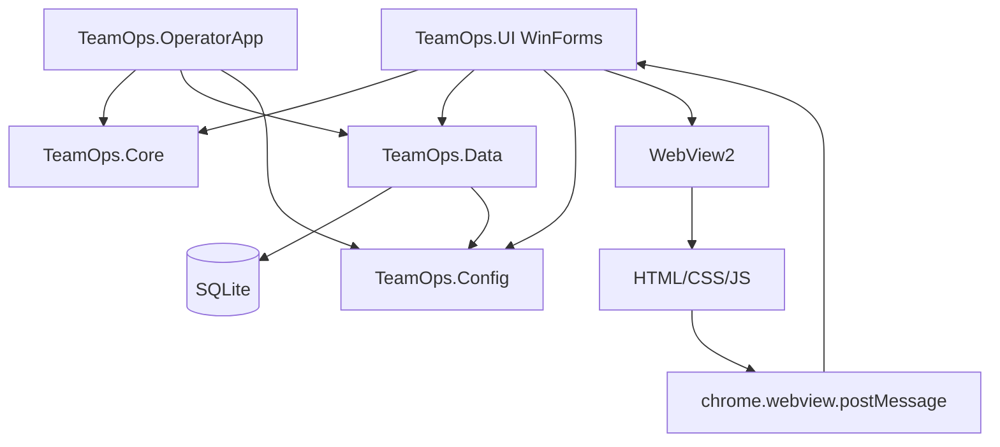
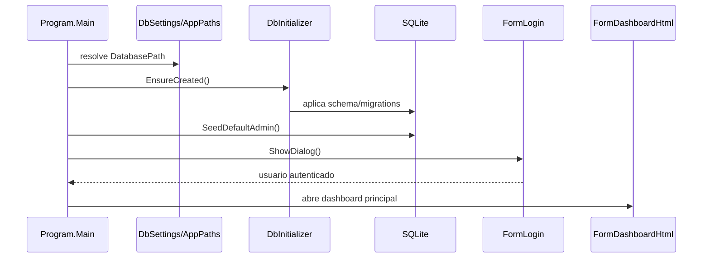
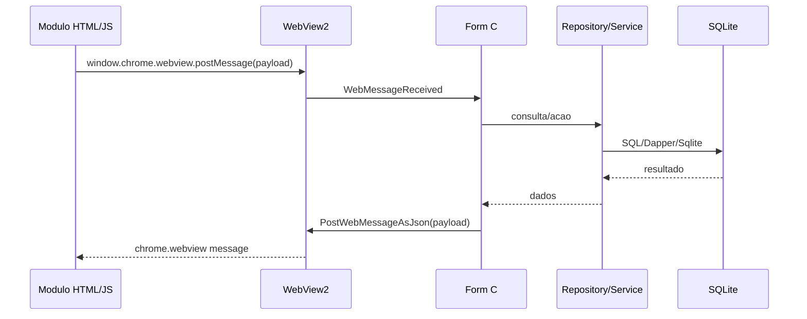

# Arquitetura

## Visao geral

TeamOps segue uma separacao em camadas simples:



## Projetos da solution

### TeamOps.UI

Aplicacao principal. Contem o dashboard WinForms/WebView2, forms tradicionais e modulos HTML em `TeamOps.UI/ui`.

Responsabilidades:

- Login e abertura do dashboard.
- Controle de acesso por nivel.
- Hospedagem dos modulos HTML via WebView2.
- Integracao com repositorios e servicos.
- Importacao/exportacao de arquivos operacionais.
- Abertura de formularios de operacao, relatorio e administracao.

### TeamOps.OperatorApp

Aplicacao WinForms separada para leitura de Hikitsugui por operador. Usa WebView2, os mesmos projetos Core/Data/Config e o caminho `HikitsuguiAttachmentPath`.

### TeamOps.Core

Camada de dominio. Contem entidades como `Operator`, `User`, `Shift`, `FollowUp`, `Hikitsugui`, `PR`, `CL`, `MachineEvent`, `OperatorPresence`, `Task` e validadores.

### TeamOps.Data

Camada de persistencia. Contem:

- `SqliteConnectionFactory`.
- `DbInitializer` e `DbSeeder`.
- `ProductionSchemaMigrator`.
- Repositorios por agregado/tabela.
- SQL externo em `Sql/Hikitsugui`, `Sql/paidleave` e `Sql/presence`.
- Migrations em `Migrations/InitialSchema.sql` e `Migrations/ProductionMonitor_Upgrade.sql`.

### TeamOps.Config

Centraliza resolucao de caminhos. `AppPaths.GetDatabasePath` busca `DatabasePath` no `App.config`; se ausente, usa `%LOCALAPPDATA%\TeamOps\TeamOps\teamops.db` ou uma pasta `data` no modo portable.

## Inicializacao



## Configuracao e caminhos

O `TeamOps.UI/App.config` define, por padrao:

- `DatabasePath`: `C:\TeamOps\DB\teamops.db`
- `PRDirectory`: `C:\TeamOps\PR\`
- `PRTemplate`: `C:\TeamOps\Modelos\ModeloPR.xlsx`
- `CLDirectory`: `C:\TeamOps\CL\`
- `CLTemplate`: `C:\TeamOps\Modelos\ModeloCL.xlsx`
- `HikitsuguiAttachmentPath`: `C:\TeamOps\Anexo\Hikitsugui\`
- `OperatorScheduleDirectory`: `C:\TeamOps\Schedule\`
- `HaidaiExportDirectory`: `C:\TeamOps\Haidai\`
- `ProductionEventsDirectory`: `C:\TeamOps\Production\Events\`
- `ProductionSourceEventsDirectory`: `C:\TeamOps\Production\Source\Events\`
- `ProductionSourceDatDirectory`: `C:\TeamOps\Production\Source\Dat\`
- `ProductionImportBatchPath`: `C:\TeamOps\Production\import-production.bat`
- `ProductionImportCompletionFile`: `C:\TeamOps\Production\import.done`
- `ProductionImportTimeoutSeconds`: `180`

Em producao, esses caminhos podem apontar para compartilhamentos de rede ou drives mapeados. Isso torna rede, permissao e disponibilidade de pasta dependencias criticas.

## WebView2 e modulos HTML

Os forms HTML chamam `EnsureCoreWebView2Async`, configuram `SetVirtualHostNameToFolderMapping("app", ...)` e navegam para `https://app/index.html`. Os arquivos HTML sao copiados para o output via `TeamOps.UI.csproj`.

Fluxo padrao:



## Forms e modulos HTML

Modulos HTML principais identificados:

- `ui/dashboard`
- `ui/access-control`
- `ui/admin`
- `ui/follow-chart`
- `ui/follow-up`
- `ui/follow-operator-report`
- `ui/follow-report`
- `ui/follow-single-report`
- `ui/hikitsugui-create`
- `ui/hikitsugui-leader-read`
- `ui/hikitsugui-reader`
- `ui/mastercard`
- `ui/mastercard-report`
- `ui/haidai`
- `ui/operators`
- `ui/operator-manager-report`
- `ui/production-monitor`
- `ui/paidleave`
- `ui/reports`
- `ui/presence`
- `ui/presence-layout`
- `ui/sobra-de-peca`
- `ui/tasks`
- `ui/tasks-report`

O dashboard abre os modulos por mensagens `open:*`, por exemplo `open:operadores`, `open:relatorios`, `open:presence`, `open:haidai`, `open:followup`, `open:tasks`, `open:mastercard`, `open:production`, `open:hikitsugui`, `open:hikitsugui_read`, `open:sobradepeca`, `open:pr`, `open:cl`, `open:yukyu`, `open:admin` e `open:accesscontrol`.

## Controle de acesso

O dashboard consulta o usuario logado e compara `AccessLevel` antes de abrir modulos sensiveis. O acesso a atribuicoes, administracao e controle de acesso exige nivel administrativo. Relatorios, presenca, Haidai, tarefas e producao exigem nivel de lideranca. Follow-up, Master Card, Hikitsugui, Sobra de Peca, PR e CL exigem nivel KL ou superior.

## Banco de dados

O banco usa SQLite com connection string:

```text
Data Source=<DatabasePath>;Cache=Shared;Mode=ReadWriteCreate
```

O schema inclui tabelas para operadores, turnos, grupos, setores, usuarios, locais, follow-up, Hikitsugui, anexos, PR, CL, maquinas, eventos de maquina, paid leave, presenca, agenda de operadores, logs, tarefas e historico de tarefas.

Repositorios usam `SqliteConnectionFactory` e Dapper ou comandos `Microsoft.Data.Sqlite`.

## Migrations e schema

`InitialSchema.sql` cria as tabelas base. `ProductionMonitor_Upgrade.sql` adiciona campos e tabelas do monitor de producao. `ProductionSchemaMigrator.Ensure` tambem protege a evolucao do schema do monitor quando a importacao/consulta de producao roda.

## Dependencias externas

- Microsoft Edge WebView2 Runtime.
- Acesso ao caminho do banco SQLite.
- Pastas configuradas em `App.config`.
- Templates Excel para PR/CL.
- Arquivos CSV de agenda de operadores.
- Arquivos TXT e DAT de producao.
- BAT de importacao de producao, quando configurado.
- Permissoes de leitura/escrita nas pastas operacionais.
